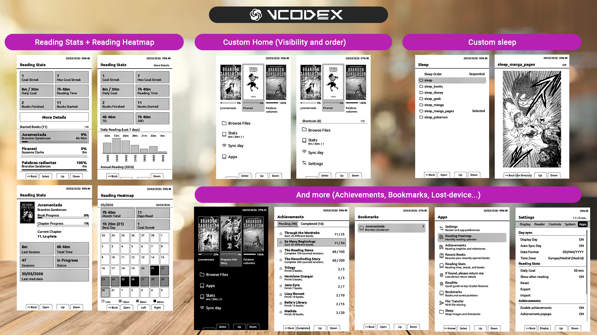

# CPR-vCodex

<p align="center">
  
  <br />
  <sub>Logo contributed by Which-Estimate4566.</sub>
</p>

## Screenshots

<p align="center">
  
</p>

## At a glance

| Item | Value |
|---|---|
| Project | `CPR-vCodex` |
| Device | `Xteink X4` |
| Current release (CPR-vCodex) build | `1.2.0.2-cpr-vcodex` |
| Base firmware line | `CrossPoint Reader 1.2.0` |
| Latest official commit reviewed | [`ce1756e`](https://github.com/crosspoint-reader/crosspoint-reader/commit/ce1756e36f8e70e4f1c10df0f5735be22eb6259c) |
| Latest official commit incorporated | [`3b12c08`](https://github.com/crosspoint-reader/crosspoint-reader/commit/3b12c083bca972d4ee79113ced0e2cf2b5291acf) |


`CPR-vCodex` is a reading-focused firmware fork for the **Xteink X4**, built on top of the stable **CrossPoint Reader** baseline and extended with analytics, reader utilities, branding cleanup, extra UI features, and carefully selected upstream carry-forwards.

The official `crosspoint-reader` project is treated as the stable reference. `vcodex` only carries forward upstream work when it is useful on the X4 and safe enough to keep the reader fast and reliable.

There may be some **involuntary or incidental X3 compatibility** because parts of the upstream codebase still carry X3-aware paths. However, `CPR-vCodex` is developed and validated on **X4**, and I do **not** currently have an **X3** device available to test or confirm that compatibility.

This project is **not affiliated with Xteink**.

## Highlights

- stable upstream-based reader baseline kept fast on large EPUBs
- richer on-device analytics: `Reading Stats`, `Reading Heatmap`, `Reading Day`, `Reading Profile`
- `Achievements` built on top of the same reading data model
- `Sync Day` for coherent day-based stats on hardware without a trustworthy sleep RTC
- EPUB bookmarks plus a global bookmarks app
- configurable `Home` and `Apps` shortcuts
- `Text Darkness`, `Reader Refresh Mode`, `Lexend`, `X Small`
- `Sleep` tools with directory selection, preview, cache, sequential and shuffle behavior
- `Dark Mode (Experimental)`
- Vietnamese UI support and synchronized translation coverage across all shipped languages

## Languages

`CPR-vCodex` currently ships with **23 UI languages**:

- English
- Spanish
- French
- German
- Czech
- Portuguese
- Russian
- Swedish
- Romanian
- Catalan
- Ukrainian
- Belarusian
- Italian
- Polish
- Finnish
- Danish
- Dutch
- Turkish
- Kazakh
- Hungarian
- Lithuanian
- Slovenian
- Vietnamese

The translation set is maintained from `english.yaml` as the source of truth, with safe English fallback when a key is not translated yet.

## Easy installation

For most users, this is the easiest way to install the firmware:

1. Download the latest `*-cpr-vcodex.bin` release file.
2. Turn on and unlock your Xteink X4.
3. Open [xteink.dve.al](https://xteink.dve.al/).
4. In `OTA fast flash controls`, select the firmware file.
5. Click `Flash firmware from file`.
6. Select the device when the browser asks.
7. Wait for the installation to finish.
8. Restart the device if needed.

To return to the original CrossPoint Reader later, repeat the same process with the original firmware file.

## 5-minute start

If you just flashed `CPR-vCodex` and want the main value quickly:

1. Open `Home > Sync Day`
2. Connect to Wi-Fi and sync the date
3. Open a book and read normally
4. Open `Apps > Reading Stats`
5. Open `Apps > Reading Heatmap`

That is enough to start using the core `vcodex` additions: coherent day-based analytics, better stats visibility, and improved app-level reading tools.

## What this fork adds

| Feature | What it adds | More info |
|---|---|---|
| `Reading Stats` | totals, streaks, goal tracking, started books, finished books, and per-book detail | [Reading analytics suite](#reading-analytics-suite) |
| `Reading Heatmap` | monthly calendar of reading intensity | [Reading analytics suite](#reading-analytics-suite) |
| `Reading Day` | one-day drill-down from the heatmap | [Reading analytics suite](#reading-analytics-suite) |
| `Reading Profile` | weekly reading behavior summary | [Reading analytics suite](#reading-analytics-suite) |
| `Achievements` | console-style milestones and optional popups | [Achievements](#achievements) |
| `Sync Day` | manual Wi-Fi date sync and fallback-day logic | [Sync Day and date model](#sync-day-and-date-model) |
| `Home + Apps shortcuts` | configurable placement, visibility, and ordering | [Home and Apps](#home-and-apps) |
| `Bookmarks` | EPUB bookmarks plus a global bookmarks app | [Bookmarks](#bookmarks) |
| `Sleep tools` | folder selection, preview, cache, sequential and shuffle behavior | [Sleep](#sleep) |
| `Text Darkness` | global `Normal / Dark / Extra Dark` text rendering control, based on the idea first seen in `crosspet` | [Settings](#settings) |
| `Reader Refresh Mode` | `Auto / Fast / Half / Full` | [Settings](#settings) |
| `Lexend` | additional reader font family | [Settings](#settings) |
| `Dark Mode (Experimental)` | optional white-on-black UI and reader presentation | [Settings](#settings) |
| `ReadMe` | on-device quick guide for the main fork features | [ReadMe](#readme) |
| `If found, please return me` | lost-device contact screen from `/if_found.txt` on the SD card | [If found, please return me](#if-found-please-return-me) |
| `Vietnamese UI` | extra UI language with matching font binding | [Languages](#languages) |

## Home and Apps

The launcher is split into `Home` and `Apps`.

`Home` stays focused on frequently used reading entry points, while `Apps` collects the richer tools added by the fork.

Notable launcher behavior:

- shortcut placement can be moved between `Home` and `Apps`
- shortcut visibility can be toggled
- ordering is configurable
- stats-related shortcuts show useful live metadata
- `Apps` paginates long lists and supports page-jump navigation

Management lives in:

- `Settings > Apps > Location Home and Apps`
- `Settings > Apps > Visibility Home and Apps`
- `Settings > Apps > Order Home shortcuts`
- `Settings > Apps > Order Apps shortcuts`

## Sync Day and date model

This part matters, because several `vcodex` features depend on day-level data.

The ESP32-C3 in the X4 does not provide a sleep-resilient real-time clock you can trust after every sleep cycle. So the fork uses a practical model:

1. `Sync Day` connects over Wi-Fi and gets a valid date/time using NTP
2. that becomes the trusted reference date for stats
3. if the live clock later becomes unreliable, the firmware falls back to the last valid saved date
4. day-based views stay coherent instead of drifting randomly

In practice:

- syncing once per day before reading is usually enough
- day-based stats depend on having a valid day reference
- timezone and date format are configurable globally

## Reading analytics suite

All reading analytics features share the same persistence model and data source.

That means these views stay coherent with each other:

- `Reading Stats`
- `Reading Heatmap`
- `Reading Day`
- `Reading Profile`
- per-book stats detail

### What gets tracked

- started books
- finished books
- total reading time
- daily reading time
- counted sessions
- daily-goal progress
- goal streak and max streak
- per-book progress and last-read state

### Important rules

- a session counts only after reaching the minimum tracked duration
- daily goal is configurable
- day-based analytics depend on a valid synced or recovered day
- books under ignored stats paths are excluded from tracking

### Main views

| View | Purpose |
|---|---|
| `Reading Stats` | main analytics hub with goal, streak, totals and started books |
| `More Details` | wider trends and graphs |
| `Reading Heatmap` | monthly calendar of reading intensity |
| `Reading Day` | one-day detail view opened from the heatmap |
| `Reading Profile` | summary of recent reading behavior |
| `Per-book stats detail` | cover, progress, sessions, time and last-read info for one book |

## Achievements

`Achievements` adds a lightweight progression layer on top of the same reading data used by stats.

It provides:

- a dedicated `Apps > Achievements` screen
- pending vs completed sections
- unlock popups
- reset support
- retroactive sync from existing reading stats

The current catalog rewards, among other things:

- started books
- counted sessions
- finished books
- total reading time
- goal-completion days
- streaks
- bookmark usage
- long sessions

## ReadMe

`ReadMe` is an on-device quick guide for the main fork features.

It includes compact help pages for:

- `Sync Day`
- `Reading Stats`
- `Bookmarks`
- `Sleep`
- `Customize Home and Apps`
- `Achievements`
- `If found, please return me`

This gives device-side help without needing to reopen GitHub every time.

## If found, please return me

This app is a simple lost-device return screen.

How it works:

- open `Apps > If found, please return me`
- the screen always shows a fixed intro message
- if `/if_found.txt` exists on the SD root, its content is shown below
- if the file does not exist, the app shows a fallback message explaining how to create it

## Bookmarks

Bookmarks are implemented for EPUB and work in two ways:

- inside the reader
- from the global `Apps > Bookmarks` screen

Supported flow:

- long-press `Select` inside EPUB reading to toggle bookmark
- open bookmark list from the reader
- reopen a book directly at a saved bookmark from the global bookmarks app
- delete individual bookmarks or all bookmarks for one book

## Sleep

The `Sleep` app makes custom sleep images easier to manage.

It supports:

- directory discovery
- preview
- sequential vs shuffle order
- persistent selected directory
- cached sleep framebuffers
- reduced repetition through recent-wallpaper tracking

## Settings

The most important fork-specific options are concentrated in `Settings > Apps`, while reader and display behavior stay under the normal settings categories.

Useful reader/display additions include:

| Area | Options |
|---|---|
| Reader | `Text Anti-Aliasing`, `Text Darkness`, `Reader Refresh Mode`, `Reader Font Family`, `Reader Font Size` |
| Display | `UI Theme`, sleep-screen controls, `Dark Mode (Experimental)`, `Sunlight Fading Fix` |
| Date | `Display Day`, `Date Format`, `Time Zone`, `Sync Day` reminder behavior |
| Reading stats | `Daily Goal`, `Show after reading`, `Reset Reading Stats`, `Export Reading Stats`, `Import Reading Stats` |
| Achievements | `Enable achievements`, `Achievement popups`, `Reset achievements`, `Sync with prev. stats` |
| Navigation | `Location Home and Apps`, `Visibility Home and Apps`, `Order Home shortcuts`, `Order Apps shortcuts` |

`Text Darkness` is a feature idea seen in the `crosspet` fork and adapted here for `vcodex`.

Font notes:

- `Bookerly` and `Noto Sans` have full regular/bold/italic coverage in the compiled sizes
- `Lexend` is available as an extra reader family
- `Lexend` italic and bold-italic still use safe fallbacks rather than separate real italic assets

## What requires Sync Day

Anything tied to day-level analytics depends on having a valid day reference.

That includes:

- daily goal
- goal streak
- max goal streak
- heatmap
- `today`
- `7D`
- `30D`
- last read date

Recommended rule:

- do `Sync Day` once before reading each day

## Data persistence

`CPR-vCodex` keeps storage compatibility as a first priority.

It does **not** use a database. User state is persisted mainly under `/.crosspoint/`.

Important artifacts include:

- `/.crosspoint/state.json`
- `/.crosspoint/reading_stats.json`
- `/.crosspoint/achievements.json`
- `/.crosspoint/recent.json`
- per-book `bookmarks.bin`
- `/exports/*.json` for reading stats export/import

This is one of the main reasons the fork was rebuilt on a cleaner upstream-derived base instead of continuing to patch the older fork in place.

## Versioning

Each packaged dev build now keeps the base firmware line and the local flash identity easy to distinguish.

Practical values to look at:

- base firmware line: `CrossPoint Reader 1.2.0`
- current dev build style: `1.2.0.2.dev1-cpr-vcodex`
- packaged artifact style: `artifacts/<version>-cpr-vcodex.bin`

The incremental `.bNNNN` suffix exists specifically to help distinguish newer flashes from older ones on real hardware.

## Main docs

- [User Guide](./USER_GUIDE.md)
- [Scope](./SCOPE.md)
- [i18n notes](./docs/i18n.md)
- [Contributing docs](./docs/contributing/README.md)

## Build from source

### Prerequisites

- `PlatformIO Core` (`pio`) or `VS Code + PlatformIO IDE`
- Python 3.8+
- USB-C cable for flashing the ESP32-C3
- Xteink X4

Possible note about X3:

- the codebase may still retain some upstream X3-aware behavior
- `CPR-vCodex` is not validated on X3 hardware
- no X3 device is currently available for testing

### Build

Use the project build wrapper:

```powershell
.\bin\build-vcodex.ps1
```

This generates a packaged firmware artifact under:

```text
artifacts/<version>-cpr-vcodex.bin
```

Versioning rules:

- release builds: `1.2.0.<release>-cpr-vcodex.bin`
- dev builds: `1.2.0.<release>.dev<build>-cpr-vcodex.bin`

## Credits

Huge credit goes to:

- the **CrossPoint Reader** project for the upstream base
- the Xteink X4 community around the firmware ecosystem
- Which-Estimate4566 for the logo artwork used in the docs

---

CPR-vCodex is **not affiliated with Xteink or any manufacturer of the X4 hardware**.
